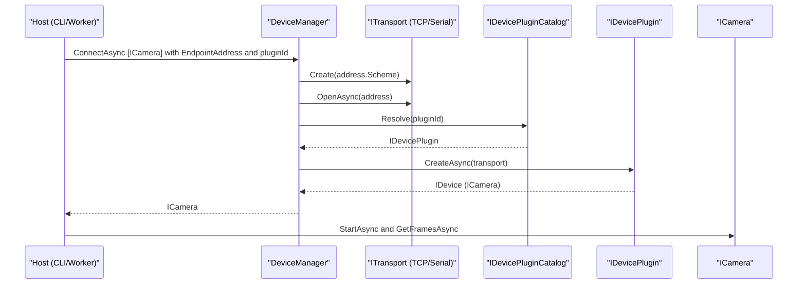

# Архитектура Prometheus.Devices

## Обзор
- Типы устройств и плагины описаны в `Devices.Abstractions`.
- Транспорт абстрагирован через `Devices.Transport.Abstractions`; реализации: TCP/Serial.
- Ядро (`Devices.Core`) координирует создание транспорта, загрузку плагинов и получение унифицированного устройства.
- Хосты (CLI/Worker) собирают зависимости, задают путь `plugins/` и инициируют работу.

## Поток вызовов (пример камеры)
1. Хост (CLI/Worker) создаёт `ITransportFactory`, `DirectoryPluginCatalog("plugins")`, `DeviceManager`.
2. Хост вызывает `DeviceManager.ConnectAsync<ICamera>(EndpointAddress("tcp", host, port, null), pluginId, ct)`.
3. `DeviceManager` создаёт `ITransport` по схеме и открывает соединение.
4. Через `IDevicePluginCatalog.Resolve(pluginId)` получает плагин и вызывает `CreateAsync(transport)`.
5. Плагин возвращает конкретное устройство (`ICamera`), которое отныне взаимодействует через унифицированные методы.

### Диаграмма последовательностей (Mermaid)

## Плагины и публикация
- Каждый плагин — отдельная DLL, кладётся в `plugins/`.
- Публикация (см. `publish.ps1`) копирует только указанные плагины в `publish/plugins`.
- Тримминг включён для хостов; динамическая загрузка может порождать предупреждения — это ожидаемо.

## Расширяемость
- Новые типы устройств добавляются через новые абстракции (`Devices.X.Abstractions`).
- Новые производители/модели — отдельные плагины, зависящие только от абстракций и транспорта.
- Новые транспорты — отдельные реализации `ITransport`.

### Как добавить новый плагин (чеклист)
- Создай проект Class Library: `src/Plugins/<Category>/<Your.Plugin>/<Your.Plugin>.csproj`.
- Зависимости: `Devices.Abstractions`, `<Category>.Abstractions`, `Devices.Transport.Abstractions`.
- Реализуй класс плагина: `IDevicePlugin` + `[DevicePlugin("id", "deviceType", "vendor", "model")]`.
- В `CreateAsync(ITransport, ct)` выполни handshake/инициализацию и верни адаптер устройства (например, `ICamera`).
- Собери проект; скопируй DLL в `apps/<Host>/plugins/` или используй `publish.ps1 -plugins <Your.Plugin>`.
- Протестируй через CLI/Worker; при необходимости добавь capability-флаги.

### Как добавить новый транспорт (чеклист)
- Создай проект: `src/Devices.Transport.<Name>/`.
- Зависимости: `Devices.Transport.Abstractions`.
- Реализуй `ITransport` (схема `Scheme`, методы `OpenAsync`, `SendAsync`, `ReceiveAsync`, `DisposeAsync`).
- Добавь фабрику в хост (или реализацию `ITransportFactory`), маппинг `scheme -> transport`.
- При публикации включай только необходимые транспорты в зависимости хоста.

## Принятые решения
- Transport-agnostic дизайн для переносимости.
- Capability-модель для мягкой эволюции контрактов.
- Избирательная публикация для минимизации поставки.

## Интеграция: готовое SDK vs собственный драйвер
В решении предусмотрены оба варианта:

- Готовое SDK (вендора):
  - Размещение: `src/SDKs/<Vendor>/<SdkName>/` (обёртка-адаптер над SDK, зависящая от `Devices.Abstractions` и соответствующих абстракций типа устройства).
  - Плюсы: быстрее внедрить, меньше риска по протоколу.
  - Минусы: зависимость от лицензии, размер поставки, возможные ограничения платформ.
  - Чеклист: подключить NuGet/Native DLL, написать адаптер → `IDevicePlugin` → вернуть `ICamera`/`IPrinter`/`IGate`.

- Собственный драйвер (reverse/протокол):
  - Размещение: `src/Drivers/<Vendor>/<DeviceModel>/` (чистая реализация поверх `ITransport`).
  - Плюсы: полный контроль, минимальный размер, кроссплатформенность.
  - Минусы: стоимость разработки и тестирования, поддержка протокола.
  - Чеклист: спецификация/сниффинг протокола → реализация кодека/команд → плагин `IDevicePlugin` → контракт типа устройства.
